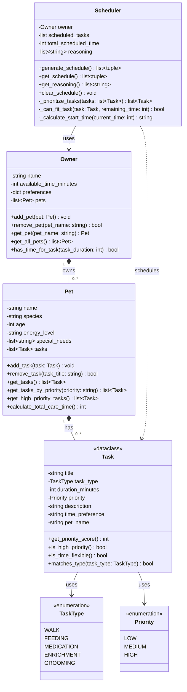

# PawPal+ Project Reflection

## 1. System Design

**a. Initial design**

### Three Core User Actions

The PawPal+ system supports three core user actions:

1. **Add a Pet** - Owner registers a pet with name, species, age, and care needs
2. **Create Care Tasks** - Owner defines tasks with duration, priority, and type (walk, feeding, medication, enrichment, grooming)
3. **Generate Daily Schedule** - System produces an optimized daily plan with reasoning based on constraints

These three actions form a complete workflow: input → define → output.

### UML Class Diagram

### Class Responsibilities

**Owner Class:**
- **Responsibility**: Represents the pet owner with time constraints and preferences
- **Key Attributes**: name, available_time_minutes, preferences dict, list of pets
- **Key Relationships**: Owns multiple Pets (one-to-many composition)
- **Design Rationale**: Centralizes owner constraints that the scheduler needs to respect when generating daily plans

**Pet Class:**
- **Responsibility**: Represents a pet with care needs and characteristics
- **Key Attributes**: name, species, age, energy_level, special_needs, list of tasks
- **Key Relationships**: Belongs to Owner, has multiple Tasks (one-to-many)
- **Design Rationale**: Encapsulates all pet-specific data, allows multiple pets per owner, each with their own task list

**Task Class:**
- **Responsibility**: Represents a single care activity with scheduling requirements
- **Key Attributes**: title, task_type (enum), duration, priority (enum), time_preference
- **Key Relationships**: Belongs to a Pet, used by Scheduler
- **Design Rationale**: Using enums (TaskType, Priority) ensures type safety and prevents typos. Time preferences allow flexible vs. fixed scheduling.

**Scheduler Class:**
- **Responsibility**: Core scheduling algorithm and reasoning engine
- **Key Attributes**: owner reference, scheduled_tasks list, reasoning list
- **Key Relationships**: Uses Owner for constraints, schedules Tasks from all Pets
- **Design Rationale**: Separates scheduling logic from data models (single responsibility principle). Maintains reasoning list for transparency.

### Design Principles Applied

- **Encapsulation**: Each class manages its own data (Owner manages pets, Pet manages tasks)
- **Single Responsibility**: Scheduler only does scheduling, not data management
- **Composition over Inheritance**: Owner contains Pets, Pet contains Tasks (strong lifecycle dependencies)
- **Type Safety**: Using Enums (TaskType, Priority) instead of strings prevents errors and enables easy filtering

**b. Design changes**

- Did your design change during implementation?
- If yes, describe at least one change and why you made it.

---

## 2. Scheduling Logic and Tradeoffs

**a. Constraints and priorities**

The PawPal+ scheduler considers the following constraints in order of importance:

1. **Time Constraint (Hard Limit)** - The scheduler respects the owner's `available_time_minutes` and never schedules tasks beyond this limit. This is the most critical constraint because it's a hard boundary - the owner simply cannot do more than they have time for.

2. **Priority Levels (Soft Ranking)** - Tasks are sorted by priority: HIGH → MEDIUM → LOW. This ensures critical needs like medication and feeding are scheduled first. For example, a high-priority medication task will always be attempted before a low-priority grooming task, regardless of when they were added.

3. **Time Preferences (Secondary Ranking)** - Within the same priority level, tasks with "morning" time preferences are prioritized. For instance, if both a medication (HIGH, morning) and a walk (HIGH, flexible) exist, medication gets scheduled first. This models real-world scenarios where certain tasks have biological time constraints (e.g., medication timing).

4. **Task Duration (Tertiary Ranking)** - Among tasks of equal priority and time preference, shorter tasks are scheduled first. This is a heuristic to fit more tasks in the available time, though the greedy algorithm doesn't guarantee optimal packing.

**Decision Rationale:**
The constraint hierarchy reflects medical/care reality: medication and feeding cannot be skipped regardless of convenience, so they rank highest. Time preferences ensure owner/pet well-being (morning routines). Duration comes last because priority matters more than optimizing time usage.

**b. Tradeoffs**

The scheduler makes one significant **Greedy Algorithm vs. Optimal Packing** tradeoff:

- **What it does:** The scheduler uses a greedy first-fit approach - it processes tasks in priority order and schedules each task immediately if it fits. It never backtracks to find a better arrangement.

- **Example of the tradeoff:** Consider:
  - Owner available time: 100 minutes
  - Task A (HIGH, 50 min) - scheduled at 9:00 AM
  - Task B (HIGH, 40 min) - scheduled at 9:50 AM
  - Task C (MEDIUM, 20 min) - SKIPPED (would exceed time)

  A more optimal algorithm might rearrange to fit all three, but this scheduler locks in scheduling decisions and moves forward.

- **Why it's reasonable:**
  1. **Transparency & Predictability:** Owners see clear reasoning for every scheduling decision. The greedy approach makes it obvious why a task was skipped ("only 10 minutes remaining").
  2. **Priority Respect:** This tradeoff prioritizes **correctness of priority enforcement** over optimal time utilization. Better to skip a low-priority task than sacrifice a high-priority one through rearrangement.
  3. **Simplicity:** Greedy algorithms are easier to understand and debug. The reasoning list directly reflects the algorithm's execution path.
  4. **Real-world applicability:** Pet owners rarely execute perfect optimal schedules anyway - they follow their routine and adjust as needed. The greedy approach mirrors this natural behavior.

**Additional Tradeoff (Phase 4): Conflict Detection Without Prevention**

The scheduler's `detect_conflicts()` method identifies overlapping tasks but **does not prevent them** from being scheduled. This is a deliberate **Detection vs. Prevention** tradeoff:

- **What it does:** The conflict detector checks if any two tasks have overlapping time windows (interval overlap: `start1 < end2 AND start2 < end1`) and returns warning messages. However, it does not block the schedule from being created or force the user to fix conflicts before proceeding.

- **Why detection only:**
  1. **User Autonomy:** Pet owners may intentionally schedule overlapping tasks (e.g., one person walks the dog while another feeds the cat). Preventing conflicts would be too restrictive.
  2. **Flexibility:** Some "conflicts" aren't real problems (e.g., 5-minute medication task during a 30-minute walk might be acceptable). Users can judge case-by-case.
  3. **Educational Value:** Warnings teach users about time management without forcing rigid rules. They learn to think critically about feasibility.
  4. **Implementation Complexity:** Prevention would require sophisticated rescheduling logic (moving tasks, finding gaps) which contradicts the simplicity of the greedy algorithm.

- **Accepted limitation:** The detector only checks for **time overlap**, not other conflicts like resource constraints (e.g., needing to be in two places at once). This is reasonable for a pet care app where most tasks can be delegated or batched.

---

## 3. AI Collaboration

**a. How you used AI**

- How did you use AI tools during this project (for example: design brainstorming, debugging, refactoring)?
- What kinds of prompts or questions were most helpful?

**b. Judgment and verification**

- Describe one moment where you did not accept an AI suggestion as-is.
- How did you evaluate or verify what the AI suggested?

---

## 4. Testing and Verification

**a. What you tested**

- What behaviors did you test?
- Why were these tests important?

**b. Confidence**

- How confident are you that your scheduler works correctly?
- What edge cases would you test next if you had more time?

---

## 5. Reflection

**a. What went well**

- What part of this project are you most satisfied with?

**b. What you would improve**

- If you had another iteration, what would you improve or redesign?

**c. Key takeaway**

- What is one important thing you learned about designing systems or working with AI on this project?
