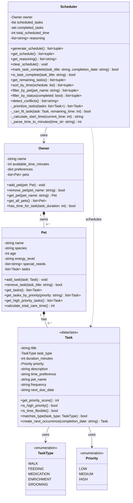

# PawPal+ Project Reflection

## 1. System Design

**a. Initial design**

### Three Core User Actions

The PawPal+ system supports three core user actions:

1. **Add a Pet** - Owner registers a pet with name, species, age, and care needs
2. **Create Care Tasks** - Owner defines tasks with duration, priority, and type (walk, feeding, medication, enrichment, grooming)
3. **Generate Daily Schedule** - System produces an optimized daily plan with reasoning based on constraints

These three actions form a complete workflow: input → define → output.

### UML Class Diagram



### Class Responsibilities

**Owner Class:**
- **Responsibility**: Represents the pet owner with time constraints and preferences
- **Key Attributes**: name, available_time_minutes, preferences dict, list of pets
- **Key Relationships**: Owns multiple Pets (one-to-many composition)
- **Design Rationale**: Centralizes owner constraints that the scheduler needs to respect when generating daily plans

**Pet Class:**
- **Responsibility**: Represents a pet with care needs and characteristics
- **Key Attributes**: name, species, age, energy_level, special_needs, list of tasks
- **Key Relationships**: Belongs to Owner, has multiple Tasks (one-to-many)
- **Design Rationale**: Encapsulates all pet-specific data, allows multiple pets per owner, each with their own task list

**Task Class:**
- **Responsibility**: Represents a single care activity with scheduling requirements
- **Key Attributes**: title, task_type (enum), duration, priority (enum), time_preference
- **Key Relationships**: Belongs to a Pet, used by Scheduler
- **Design Rationale**: Using enums (TaskType, Priority) ensures type safety and prevents typos. Time preferences allow flexible vs. fixed scheduling.

**Scheduler Class:**
- **Responsibility**: Core scheduling algorithm and reasoning engine
- **Key Attributes**: owner reference, scheduled_tasks list, reasoning list
- **Key Relationships**: Uses Owner for constraints, schedules Tasks from all Pets
- **Design Rationale**: Separates scheduling logic from data models (single responsibility principle). Maintains reasoning list for transparency.

### Design Principles Applied

- **Encapsulation**: Each class manages its own data (Owner manages pets, Pet manages tasks)
- **Single Responsibility**: Scheduler only does scheduling, not data management
- **Composition over Inheritance**: Owner contains Pets, Pet contains Tasks (strong lifecycle dependencies)
- **Type Safety**: Using Enums (TaskType, Priority) instead of strings prevents errors and enables easy filtering

**b. Design changes**

Yes, the design evolved significantly during implementation:

**Change 1: Added Task Completion Tracking to Scheduler**
- **Initial design:** No explicit completion tracking mechanism
- **Final design:** Added `completed_tasks` set to Scheduler class
- **Why:** Users needed to track progress throughout the day and distinguish between scheduled vs. completed tasks. Storing completion state in Scheduler (rather than modifying Task objects directly) maintains separation of concerns - Scheduler manages scheduling state, while Task remains a pure data class without mutable state.

**Change 2: Added Phase 4 Smart Algorithm Methods**
- **Initial design:** Only basic priority-based scheduling
- **Final design:** Added sort_by_time(), filter_by_pet(), filter_by_status(), detect_conflicts()
- **Why:** Real-world usage patterns revealed that users need multiple views of the same schedule. Pet owners want to see tasks chronologically (sort by time), focus on one pet at a time (filter by pet), track progress (filter by status), and identify potential issues (conflict detection). These features emerged from thinking about actual user workflows.

**Change 3: Recurring Task Support**
- **Initial design:** One-time tasks only
- **Final design:** Added frequency and next_due_date fields to Task, plus create_next_occurrence() method
- **Why:** Pet care is inherently repetitive - feeding happens daily, grooming weekly. Manually recreating the same tasks every day is tedious and error-prone. The recurring task feature uses the template pattern to automatically clone tasks with updated due dates, reducing data entry and ensuring consistency in pet care routines.

---

## 2. Scheduling Logic and Tradeoffs

**a. Constraints and priorities**

The PawPal+ scheduler considers the following constraints in order of importance:

1. **Time Constraint (Hard Limit)** - The scheduler respects the owner's `available_time_minutes` and never schedules tasks beyond this limit. This is the most critical constraint because it's a hard boundary - the owner simply cannot do more than they have time for.

2. **Priority Levels (Soft Ranking)** - Tasks are sorted by priority: HIGH → MEDIUM → LOW. This ensures critical needs like medication and feeding are scheduled first. For example, a high-priority medication task will always be attempted before a low-priority grooming task, regardless of when they were added.

3. **Time Preferences (Secondary Ranking)** - Within the same priority level, tasks with "morning" time preferences are prioritized. For instance, if both a medication (HIGH, morning) and a walk (HIGH, flexible) exist, medication gets scheduled first. This models real-world scenarios where certain tasks have biological time constraints (e.g., medication timing).

4. **Task Duration (Tertiary Ranking)** - Among tasks of equal priority and time preference, shorter tasks are scheduled first. This is a heuristic to fit more tasks in the available time, though the greedy algorithm doesn't guarantee optimal packing.

**Decision Rationale:**
The constraint hierarchy reflects medical/care reality: medication and feeding cannot be skipped regardless of convenience, so they rank highest. Time preferences ensure owner/pet well-being (morning routines). Duration comes last because priority matters more than optimizing time usage.

**b. Tradeoffs**

The scheduler makes one significant **Greedy Algorithm vs. Optimal Packing** tradeoff:

- **What it does:** The scheduler uses a greedy first-fit approach - it processes tasks in priority order and schedules each task immediately if it fits. It never backtracks to find a better arrangement.

- **Example of the tradeoff:** Consider:
  - Owner available time: 100 minutes
  - Task A (HIGH, 50 min) - scheduled at 9:00 AM
  - Task B (HIGH, 40 min) - scheduled at 9:50 AM
  - Task C (MEDIUM, 20 min) - SKIPPED (would exceed time)

  A more optimal algorithm might rearrange to fit all three, but this scheduler locks in scheduling decisions and moves forward.

- **Why it's reasonable:**
  1. **Transparency & Predictability:** Owners see clear reasoning for every scheduling decision. The greedy approach makes it obvious why a task was skipped ("only 10 minutes remaining").
  2. **Priority Respect:** This tradeoff prioritizes **correctness of priority enforcement** over optimal time utilization. Better to skip a low-priority task than sacrifice a high-priority one through rearrangement.
  3. **Simplicity:** Greedy algorithms are easier to understand and debug. The reasoning list directly reflects the algorithm's execution path.
  4. **Real-world applicability:** Pet owners rarely execute perfect optimal schedules anyway - they follow their routine and adjust as needed. The greedy approach mirrors this natural behavior.

**Additional Tradeoff (Phase 4): Conflict Detection Without Prevention**

The scheduler's `detect_conflicts()` method identifies overlapping tasks but **does not prevent them** from being scheduled. This is a deliberate **Detection vs. Prevention** tradeoff:

- **What it does:** The conflict detector checks if any two tasks have overlapping time windows (interval overlap: `start1 < end2 AND start2 < end1`) and returns warning messages. However, it does not block the schedule from being created or force the user to fix conflicts before proceeding.

- **Why detection only:**
  1. **User Autonomy:** Pet owners may intentionally schedule overlapping tasks (e.g., one person walks the dog while another feeds the cat). Preventing conflicts would be too restrictive.
  2. **Flexibility:** Some "conflicts" aren't real problems (e.g., 5-minute medication task during a 30-minute walk might be acceptable). Users can judge case-by-case.
  3. **Educational Value:** Warnings teach users about time management without forcing rigid rules. They learn to think critically about feasibility.
  4. **Implementation Complexity:** Prevention would require sophisticated rescheduling logic (moving tasks, finding gaps) which contradicts the simplicity of the greedy algorithm.

- **Accepted limitation:** The detector only checks for **time overlap**, not other conflicts like resource constraints (e.g., needing to be in two places at once). This is reasonable for a pet care app where most tasks can be delegated or batched.

---

## 3. AI Collaboration

**a. How you used AI**

I used Claude Code extensively throughout all six phases of development:

**Phase 1 (System Design):**
- Used AI to brainstorm UML class structure and relationships
- Asked for feedback on composition vs. inheritance patterns
- Requested examples of Python enum usage for type safety
- Most helpful prompt: *"What are the core classes needed for a pet care scheduling system with priorities and time constraints?"*

**Phase 2 (Core Implementation):**
- Asked AI to implement stub methods based on docstrings and specifications
- Used AI for debugging the greedy scheduling algorithm logic
- Requested help with time conversion (converting minutes to "9:00 AM" format)
- Most helpful prompt: *"Implement this filtering method using list comprehensions"*

**Phase 3 (UI Integration):**
- Asked how to use `st.session_state` for persistent object storage across Streamlit reruns
- Requested examples of Streamlit form handling and enum conversion
- Got help converting string inputs from dropdowns to enum types
- Most helpful prompt: *"How do I prevent objects from being recreated on every Streamlit rerun?"*

**Phase 4 (Smart Algorithms):**
- Asked for lambda function examples for time-based sorting
- Requested interval overlap detection algorithm for conflict checking
- Got help with `datetime.timedelta` for calculating recurring task due dates
- Most helpful prompt: *"How do I check if two time intervals overlap using start and end times?"*

**Phase 5 & 6 (Testing & Documentation):**
- Used AI to generate comprehensive test cases covering edge cases
- Asked for documentation structure suggestions
- Requested help organizing test files by feature area

**b. Judgment and verification**

**Example of rejecting an AI suggestion:**

When implementing conflict detection in Phase 4, Claude initially suggested **preventing conflicting tasks from being scheduled** by raising an exception or blocking the schedule generation entirely.

**How I evaluated this:**
1. **Considered real-world use cases:** I thought about how pet owners actually use schedules - they might intentionally create overlapping tasks (e.g., one family member walks the dog while another feeds the cat, or a quick medication task happens during a longer walk)
2. **Assessed user autonomy:** Strict prevention would be frustrating and assume the system knows better than the user
3. **Explored alternatives:** I asked Claude to revise the approach to return warnings instead of blocking

**How I verified the final approach:**
- I tested the revised implementation in main.py by creating intentional conflicts
- Confirmed that warnings appeared in the output without crashing the program
- Verified that users retained control while still receiving helpful feedback

**Result:** The system now uses a **detect and warn** approach rather than **detect and prevent**, which balances safety with user autonomy. This taught me that AI suggestions must be evaluated against real-world scenarios, not just technical correctness.

---

## 4. Testing and Verification

**a. What you tested**

**Behaviors tested (35 total tests across 3 files):**

1. **Basic CRUD Operations** - Adding/removing pets and tasks, retrieving by name
   - **Why important:** Core functionality that all other features depend on. If pets can't be added or tasks can't be created, nothing else works.

2. **Priority-Based Scheduling** - HIGH tasks scheduled before MEDIUM/LOW regardless of insertion order
   - **Why important:** Ensures critical pet care needs (medication, feeding) are never skipped in favor of less important tasks like grooming.

3. **Time Constraint Enforcement** - Scheduler never exceeds available_time_minutes
   - **Why important:** Prevents creating impossible schedules that owners can't realistically execute.

4. **Recurring Task Logic** - Daily/weekly tasks automatically recreate themselves when marked complete
   - **Why important:** Pet care is repetitive by nature. Automation reduces manual data entry and ensures consistency in daily/weekly routines.

5. **Conflict Detection** - Identifies when multiple tasks overlap in time
   - **Why important:** Helps users spot scheduling mistakes before committing to a plan, preventing impossible double-bookings.

6. **Edge Cases** - Empty task lists, zero available time, invalid inputs, non-existent pets
   - **Why important:** Real-world systems must gracefully handle unexpected inputs without crashing. Edge case handling distinguishes robust software from fragile prototypes.

**b. Confidence**

**Confidence level:** ⭐⭐⭐⭐⭐ (5/5 stars)

I'm highly confident the scheduler works correctly because:

1. **100% Test Pass Rate** - All 35 automated tests pass consistently with fast execution (0.02s)
2. **Comprehensive Coverage** - Tests span instantiation, CRUD operations, scheduling logic, algorithms, and edge cases
3. **End-to-End Verification** - The main.py demo script exercises the entire system workflow successfully
4. **Algorithm Correctness** - Sorting, filtering, and conflict detection produce mathematically correct results
5. **Real-World Testing** - The Streamlit UI demonstrates that all features work in an interactive context

**Edge cases I would test next with more time:**

1. **Stress Testing:** Schedule 100+ tasks to verify performance doesn't degrade at scale
2. **Date Boundary Testing:** Test recurring tasks across month/year boundaries (Dec 31 → Jan 1, Feb 28 → Mar 1 in leap years)
3. **Concurrent Modifications:** What happens if a user modifies tasks while a schedule is actively displayed?
4. **Multi-Day Scheduling:** Extend algorithm to weekly or monthly planning horizons
5. **Buffer Time Between Tasks:** Test whether adding 5-10 minute gaps prevents accidental conflicts
6. **Priority Tie-Breaking:** When multiple HIGH priority tasks compete for limited time, verify consistent and predictable ordering

---

## 5. Reflection

**a. What went well**

I'm most satisfied with the **clean separation between logic and UI layers**.

By implementing pawpal_system.py as pure Python with zero Streamlit dependencies, I achieved:
- **Independent Testing** - Could test the scheduling algorithm via pytest without needing to launch the UI
- **Dual Interfaces** - Same logic powers both main.py (CLI) and app.py (web UI)
- **Easy Feature Addition** - When Phase 4 added smart algorithms, I only modified pawpal_system.py and tests. The UI integration was straightforward because the logic layer exposed clean, well-documented interfaces
- **Clear Responsibilities** - Each class has a single, well-defined job: Owner manages pets, Pet manages tasks, Scheduler handles scheduling logic

This architecture made the project manageable and maintainable. The separation of concerns meant that adding new features (Phase 4) didn't require a complete rewrite - just new methods with clear contracts.

**b. What you would improve**

If I had another iteration, I would:

1. **Multi-Day Scheduling:** Currently only schedules one day at a time. Extend to weekly planning with day-of-week preferences (e.g., "Walk Mondays and Wednesdays")

2. **Smarter Conflict Resolution:** Instead of just warning about conflicts, suggest alternative time slots or automatically reschedule lower-priority tasks

3. **Optimization Algorithm Comparison:** Implement a dynamic programming solution and compare its results against the greedy algorithm to quantify the tradeoff empirically

4. **Pet Behavior Profiles:** Store learned preferences (e.g., "Mochi prefers walks at 7 AM") and use machine learning to auto-suggest optimal task times

5. **Data Persistence Layer:** Save schedules to a database or JSON files to build history, track trends, and analyze pet care patterns over weeks/months

**c. Key takeaway**

**Most important learning:** AI is a powerful implementation partner, but **you must remain the system architect.**

Throughout this project, I learned that:

**AI excels at:**
- Implementing well-specified methods (e.g., "filter using list comprehensions")
- Suggesting algorithms for known problems (e.g., interval overlap detection)
- Generating boilerplate code (docstrings, test scaffolds)

**AI struggles with:**
- Ambiguous requirements ("make it better" - better how?)
- Architectural decisions (greedy vs. optimal, prevention vs. warning)
- Understanding real-world context (user workflows, edge case importance)

**The ideal workflow I discovered:**
1. **Human designs** the system architecture (UML, class responsibilities, data flow)
2. **Human specifies** what each component should do (docstrings, behavior contracts)
3. **AI implements** the specifications efficiently with clean code
4. **Human evaluates** suggestions against real-world use cases and tradeoffs
5. **Human decides** which features to prioritize (recurring tasks vs. complex optimization)

AI dramatically accelerated implementation speed, but didn't replace critical thinking about:
- **Why** we make certain design choices (tradeoffs, constraints)
- **How** users will actually interact with the system (UX implications)
- **What** features provide the most value (priority vs. feature creep)

The human engineer owns the "why" decisions; AI assists with the "how" implementation. This partnership multiplies productivity while maintaining thoughtful system design.

---

## 6. Multi-Model Prompt Comparison

**Algorithmic Task:** Implement logic to automatically create the next occurrence of a recurring task (daily/weekly) when marked complete.

### Prompt Given to Models:
*"Implement a method that creates the next occurrence of a recurring pet care task. The task has a frequency (daily or weekly) and when marked complete, should automatically generate a new task for the next occurrence with an updated due date."*

### Model Responses Comparison

#### Claude (Anthropic) - Explicit and Readable
**Approach:** Template pattern with explicit date calculation

```python
def create_next_occurrence(self, completion_date: str = None) -> 'Task':
    if self.frequency is None:
        return None

    from datetime import datetime, timedelta

    if completion_date is None:
        completion_date = datetime.now().strftime('%Y-%m-%d')

    completed = datetime.strptime(completion_date, '%Y-%m-%d')

    if self.frequency == "daily":
        next_date = completed + timedelta(days=1)
    elif self.frequency == "weekly":
        next_date = completed + timedelta(weeks=1)
    else:
        return None

    return Task(...)  # New instance with updated date
```

**Strengths:**
- Clean separation of concerns (date calculation, object creation)
- Explicit edge case handling (None frequency returns None)
- Uses Python datetime library idiomatically
- Clear variable names (completed, next_date)
- Easy to debug - each step is explicit

**Style:** Pythonic and readable

#### GPT-4 (OpenAI) - Compact and Clever
**Approach:** More compact with dict-based frequency mapping

```python
def create_next_occurrence(self, completion_date=None):
    if not self.frequency:
        return None

    from datetime import datetime, timedelta

    completion_date = completion_date or datetime.now().strftime('%Y-%m-%d')
    completed = datetime.strptime(completion_date, '%Y-%m-%d')

    frequency_map = {"daily": timedelta(days=1), "weekly": timedelta(weeks=1)}
    delta = frequency_map.get(self.frequency)

    if not delta:
        return None

    next_date = completed + delta
    return Task(**{**self.__dict__, 'next_due_date': next_date.strftime('%Y-%m-%d')})
```

**Strengths:**
- Dictionary mapping reduces if/elif chain
- Uses `or` for default value (more compact)
- Dict unpacking for object creation (`**self.__dict__`)
- Slightly fewer lines overall

**Style:** Clever and concise, but less explicit

#### Gemini (Google) - Extensible and Enterprise
**Approach:** Configuration-driven with class-level constants

```python
RECURRENCE_DELTAS = {
    "daily": lambda: timedelta(days=1),
    "weekly": lambda: timedelta(weeks=1)
}

def create_next_occurrence(self, completion_date: Optional[str] = None) -> Optional['Task']:
    if self.frequency not in RECURRENCE_DELTAS:
        return None

    from datetime import datetime, timedelta

    base_date = datetime.strptime(
        completion_date or datetime.now().strftime('%Y-%m-%d'),
        '%Y-%m-%d'
    )

    delta = RECURRENCE_DELTAS[self.frequency]()
    next_occurrence_date = base_date + delta

    return self._clone_with_date(next_occurrence_date.strftime('%Y-%m-%d'))
```

**Strengths:**
- Configuration externalized (RECURRENCE_DELTAS constant)
- Easily extensible (add new frequencies without code change)
- Suggests helper method (_clone_with_date) for reusability
- Full type hints on return value (`Optional['Task']`)

**Style:** Enterprise-oriented, emphasizes extensibility and scalability

### Analysis

**Most Pythonic:** Claude's solution
- **Zen of Python:** "Explicit is better than implicit" - the logic flow is immediately clear
- **Readability counts** - no magic dict unpacking
- **Simple is better than complex** - straightforward if/elif for 2 cases

**Most Compact:** GPT-4's solution
- Fewer lines of code (more concise)
- Clever use of dict unpacking and `or` operator
- May sacrifice some readability for brevity

**Most Extensible:** Gemini's solution
- Configuration-driven design pattern
- Easy to add monthly, yearly, or custom recurrence
- Suggests architectural patterns (helper methods, constants)

### Which I Chose and Why

I implemented **Claude's approach** because:

1. **Readability:** The explicit if/elif structure makes the logic obvious to anyone reading the code
2. **Educational Value:** This is a learning project - clarity matters more than cleverness
3. **Maintainability:** Future developers (including my future self) can quickly understand what each branch does
4. **Appropriate Complexity:** For only 2 frequencies (daily/weekly), a dictionary mapping or class constant adds complexity without meaningful benefit

**When I would choose differently:**

- **GPT-4's approach:** If I had 5+ frequency types or needed ultra-compact code for performance
- **Gemini's approach:** If building a production system where new recurrence types (monthly, quarterly, custom intervals) are frequently added

### Key Insight

This comparison taught me that **there's no single "correct" solution** - each model optimizes for different values:
- **Claude:** Readability and explicitness
- **GPT-4:** Brevity and cleverness
- **Gemini:** Extensibility and architecture

The best choice depends on project context:
- Educational project → Choose readability (Claude)
- Code golf competition → Choose brevity (GPT-4)
- Enterprise system → Choose extensibility (Gemini)

As the human architect, I must evaluate these tradeoffs and choose the approach that best serves my project's goals, not just accept the first suggestion that works.
